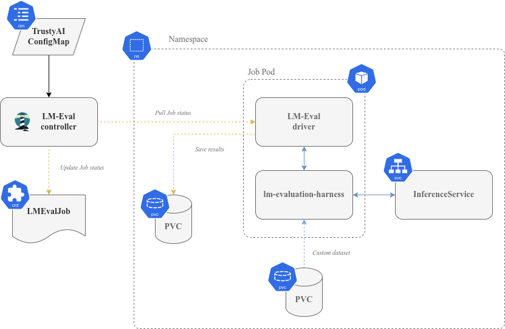

## Title

LM-Eval

## Context and Problem Statement

The successful use of large language models (LLMs) depends heavily on their performance in specific tasks, making a robust framework for evaluating these models essential to ensure their accuracy and reliability.

Current evaluation solutions often involve *ad-hoc* benchmarks, which can be time-consuming to create and maintain. This process becomes even more complex when deploying models across different environments such as Kubernetes. To simplify this process, we propose leveraging a comprehensive benchmarking framework, [`lm-evaluation-harness`](https://github.com/EleutherAI/lm-evaluation-harness), which can be easily deployed and with reproducible results.

Our goal is to introduce a simple way to automate (and abstract) the deployment of this benchmarking framework on Kubernetes, providing a simple solution to adopt a standardised evaluation framework without requiring extensive expertise in benchmarking or manual intervention.

## Goals

- **Simplify the Benchmarking Process**

  Provide an easy-to-use solution for deploying and managing LLM benchmarking tasks on Kubernetes without requiring deep expertise in evaluation frameworks or infrastructure management.

- **Ensure Reproducibility and Standardization**

  Enable a consistent and standardized evaluation environment to ensure reproducible results across different models, benchmarks, and datasets, minimizing variability in evaluation outcomes.

- **Automate Model and Benchmark Configuration**

  Automate the process of configuring and deploying LLM benchmarks by abstracting the complexity of model selection, benchmark settings, and dataset management, reducing manual intervention.

- **Support Scalable and Isolated Job Execution**

  Ensure the framework can run isolated, scalable evaluation jobs on Kubernetes, allowing for flexibility in resource allocation and efficient handling of multiple concurrent jobs.

- **Facilitate Storage and Access to Evaluation Results**

  Provide mechanisms for logging, tracking, and storing evaluation results, ensuring that results are accessible, persistent, and easy to analyze over time.

## Non-Goals

- Implement actual new benchmarks or evaluations
- For this current iteration, no support is planned for model servers other than the ones supported by Open Data Hub ([ODH](https://opendatahub.io/)) and [Kubeflow](https://www.kubeflow.org/).

## Current Situation

Currently, there is no standardised framework for evaluating models within TrustyAI (or even ODH and Kubeflow). The lack of a robust foundation for benchmarking models can hinder the development and deployment of complex models.

Key challenges with existing evaluation protocols include:

- Time-consuming creation and maintenance of *ad-hoc* benchmarks
- Complexity in deploying models across different environments, namely Kubernetes
- Limited out-of-the-box support for model servers provided by Open Data Hub and Kubeflow.

## Proposal

To achieve the proposed goals, we will focus on the following approach:

1. **Define a Custom Resource Definition (CRD) for LM-Eval Jobs**

   Create a CRD that encapsulates the configuration details of a benchmark/evaluation, including:

   - Model type, name, and location
   - Benchmark type and name
   - Custom benchmark configurations (if applicable)
   - Dataset or custom dataset specifications
   - Benchmark/evaluation-specific configuration options

2. **Develop a Translation Layer between the Custom Resource and `lm-evaluation-harness`**

   Implement a translation layer to decode the custom resource and translate it into a format compatible with `lm-evaluation-harness`:

   - Dynamically generate required configurations based on custom resource input
   - Handle any necessary conversions or transformations

3. **Support Isolated Evaluation Jobs**

   Create isolated evaluation jobs that support storing results, allowing for:

   - Log stream storage
   - Status updates within the custom resource
   - Persistent volume storage for benchmark results


### Architecture



### Configurable Settings for LM-Eval Service

LM-Eval global configuration will be done via the existing TrustyAI configuration `ConfigMap`. The new fields to be added are:

#### LM-Eval Configuration Properties

- **`lmes-detect-device`** (`bool`): Detect GPU availability for the `--device` argument. Default: `true`
- **`lmes-pod-image`**: Container image for the LM-Eval job. Default: `quay.io/trustyai/ta-lmes-job:latest`
- **`lmes-driver-image`**: Container image for the LM-Eval driver. Default: `quay.io/trustyai/ta-lmes-driver:latest`
- **`lmes-grpc-port`** (`int`): Internal gRPC port number. Default: `8082`
- **`lmes-grpc-service`**: Internal service name of the gRPC service. Default: `trustyai-service-operator-lmes-grpc`
- **`lmes-image-pull-policy`**: Image pulling policy for the evaluation job. Default: `Always`
- **`lmes-default-batch-size`** (`int`): Default batch size for local model inference API. Default: `8`
- **`lmes-max-batch-size`** (`int`): Maximum batch size users can specify in an evaluation job. Default: `24`
- **`lmes-pod-checking-interval`** (`str`): Interval to check the job pod for an evaluation job. Default: `10s`
- **`driver-report-interval`** (`str`): Interval that the driver reports job status. Default: `10s`

#### Security Settings

- **`lmes-grpc-server-secret`**: Secret name for gRPC server TLS.
- **`lmes-grpc-client-secret`**: Secret name for gRPC client mTLS.

### `LMEvalJob` Custom Resource Definition (CRD)

A Custom Resource Definition for defining and managing evaluation jobs in TrustyAI's LM-Eval service.

#### Overview

`LMEvalJob` objects represent an evaluation job executed by the LM-Eval service. To create a new evaluation job, an instance of this CRD must be created with the required information, including model, tasks, secrets, etc.

#### Properties

- **`model`**: Specify which model type or provider is evaluated (supported models are listed below). This field directly maps to the `--model` argument of the `lm-evaluation-harness` and supports options like:
  - `hf`: Hugging Face models. Supported APIs include [huggingface.py](https://github.com/EleutherAI/lm-evaluation-harness/blob/main/lm_eval/models/huggingface.py#L55), local completions (OpenAI API-compatible server), and more.
- **`modelArgs`**: A list of paired name and value arguments for the model type. Each model supports different arguments. Supported arguments include:
  - For `hf`:
    - `pretrained`: The name of the pre-trained model, e.g., `google/flan-t5-base`.
- **`taskList`**: A list of evaluation tasks. Task information can be specified in two ways:
  - **`taskNames`**: Specify a list of task names supported by the `lm-evaluation-harness` directly.
  - **`taskRecipes`**: Specify the task using the [Unitxt](https://www.unitxt.ai/en/latest/) recipe format:
    - **`card`**: Specify a Unitxt card from the Unitxt catalog using the card's ID, e.g., `cards.wnli`.
    - **`template`**: Specify a Unitxt template from the Unitxt catalog using the template's ID.
    - **`task`** (optional): Specify a Unitxt[^unitxt] task from the [Unitxt catalog](https://www.unitxt.ai/en/latest/catalog/catalog.cards.dir.html) using the task's ID. A Unitxt card has a pre-defined task. Only specify this if you want to run a different task.
    - **`metrics`** (optional): Specify a list of Unitxt metrics from the Unitxt catalog using the metric's ID. A Unitxt task has a set of pre-defined metrics. Only specify this if you need different metrics.
    - **`format`** (optional): Specify a Unitxt format from the Unitxt catalog using the format's ID.
    - **`loaderLimit`** (optional): Specifies the maximum number of instances per stream to be returned from the loader (used to reduce loading time in large datasets).
    - **`numDemos`** (optional): Number of few-shot examples to be used.
    - **`demosPoolSize`** (optional): Size of the few-shot pool.

[^unitxt]: <https://www.unitxt.ai/en/latest/>

#### Example

```yaml
apiVersion: trustyai.opendatahub.io/v1alpha1
kind: LMEvalJob
metadata:
  labels:
    name: evaljob-sample
spec:
  model: hf
  modelArgs:
    - name: pretrained
      value: google/flan-t5-base
  taskList:
    taskRecipes:
      - card: "cards.wnli"
        template: "templates.classification.multi_class.relation.default"
  logSamples: true
```

This example uses the Hugging Face[^hf] (`hf`) model with its pre-trained weights, along with the `wnli` card from [Unitxt](https://www.unitxt.ai/en/latest/) and its corresponding template for multi-class relation extraction over the GLUE[^glue] dataset.

[^hf]: <https://huggingface.co/>
[^glue]: <https://huggingface.co/datasets/nyu-mll/glue>

### Driver

- The driver will expose the status of the evaluation job to be consumed by the operator.

  The controller will periodically check an endpoint exposed by the LM-Eval driver to retrieve the status of evaluation jobs. This polling mechanism ensures that the operator has the latest information about the job's progress and can update the status of the `LMEvalJob` resource accordingly
- The driver will take the CR configuration (as provided by the operator) and execute a run of the evaluation harness, constructing the required CLI parameters.

  The LM-Eval driver acts as an intermediary between the operator's controller and the evaluation job pod. It interprets the configuration specified in the `LMEvalJob` resource, constructs the appropriate command-line arguments for `lm-evaluation-harness`, and manages the execution of the evaluation job.

### Job Pod

The Job pod encapsulates the `lm-evaluation-harness` project. From an execution standpoint, it will operate similarly to a local `lm-evaluation-harness` run with the following distinctions:

- Invocation parameters are constructed by the driver, translated from the controller.
- Model invocation will support remote models (i.e., not located in the pod's container), such as vLLM deployed on ODH.
- The Job pod image will be built from an `lm-evaluation-harness` midstream (URL to be provided).

### Threat Model

| Threat Actor     | Attack Vector                  | Impact                                  | Description                                                                                                                                                                    |
|------------------|--------------------------------|-----------------------------------------|--------------------------------------------------------------------------------------------------------------------------------------------------------------------------------|
| Controller       | Self                           | Inconsistent data, misconfigurations    | The controller must implement a polling mechanism to retrieve the status of `LMEvalJob`. This will ensure updates and prevent outdated information. |
| User/Controller  | Validation                     | Custom data corruption                  | Failure to implement robust validation and sanitisation operations on custom dataset inputs can lead to model corruption.                                                       |
| User/Controller  | Sanitisation                   | Malicious queries execution             | Failure to prevent malicious `unitxt` query manipulation can result in inaccurate evaluations.                                                                                   |

## Alternatives Considered / Rejected

Initially, the TrustyAI service was considered for use in providing an evaluation suite similar to `lm-evaluation-harness`.

The main consideration was that the TrustyAI service's design is oriented for real-time or near-real-time metrics and, as such, it is not well-suited for long-running jobs, making it a poor choice for this specific use case.

TrustyAI also provides a limited number of language model metrics, which would require re-implementing almost every evaluation task already available in the `lm-evaluation-harness` open source project.

## Challenges

1. **Maintaining midstream compatibility**

   Ensuring that the solution with existing upstream codebases and can be patched to address any vulnerabilities or security concerns.

2. **Performing upstream contributions**

   Integrating new core features and functionality into the TrustyAI LM-Eval implementation may require coordinating with upstream developers, while also ensuring backwards compatibility.

3. **Supporting model serving in ODH**

   Ensuring that the evaluation suite meets the security standards and authentication methods for model serving as implemented in Open Data Hub and Kubeflow.

## Dependencies

1. **`lm-evaluation-harness` Project**

   The core project[^leh] that will be integrated and extended to provide a comprehensive evaluation suite for language models.

[^leh]: <https://github.com/EleutherAI/lm-evaluation-harness>

## Consequences if Not Completed

1. **Inadequate model validation**

   Without a robust evaluation suite, models may not be thoroughly validated, leading to a gap in TrustyAI's commitment of becoming a general tool for AI/ML trustworthiness.

2. **No evaluation standards**

   Without a standardised evaluation framework, it will be difficult to compare different models and metrics, making it harder to identify model problems on ODH and Kubeflow.
